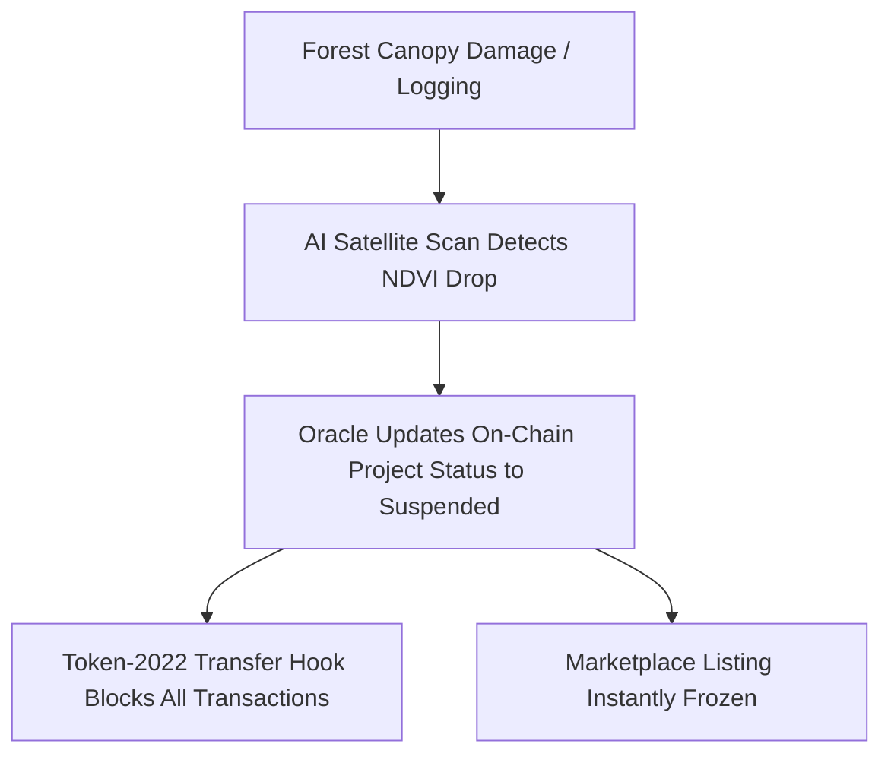

# TerraVerify Investor Pitch Deck

*Real-Time Satellite-Audited Carbon Credits on Solana*

---

## Slide 1: Title & Mission
### TerraVerify
* **Subtitle:** Solving the Carbon Offset Trust Crisis with AI Satellite Telemetry & Solana Token-2022.
* **Tagline:** Don't Trust. Verify from Space.
* **Mission:** To eliminate the $2B carbon market scam by creating audit-proof, dynamic, real-time verified carbon tokens that enterprises can purchase with 100% compliance guarantee.

---

## Slide 2: The Problem
### The Carbon Offset Trust Crisis
Traditional carbon markets are broken due to systemic fraud, lack of verification, and double counting:
1. **The "Phantom Forest" Epidemic:** A recent *Guardian* & *Bloomberg* investigation revealed that **over 90% of rainforest credits** issued by Verra (the largest registry) did not represent genuine carbon reductions. The trees either did not exist or had been logged.
2. **Outdated Manual Audits:** Existing registries send human inspectors to physically measure trees once every **5 to 10 years**. Deforestation occurring between audits goes completely undetected.
3. **Double Counting & Reuse:** Once a company purchases a carbon credit, tracking its retirement is a manual paperwork process, leading to the same offset being claimed multiple times.
4. **Corporate Brand Damage:** Major corporations (e.g., Disney, Gucci, Delta) are facing greenwashing lawsuits and public PR backlashes for buying cheap, unverified "fake" offsets.

---

## Slide 3: The Solution
### Real-Time AI Verification
TerraVerify replaces manual, paper-based trust with automated, cryptographic proof:
1. **Continuous Satellite Audits:** Our Python AI pipeline ingests infrared and red bands from **Copernicus Sentinel-2 satellites** every 3-5 days.
2. **AI Canopy Health (NDVI) Scoring:** The system automatically calculates Normalized Difference Vegetation Index (NDVI) and Canopy Quality Scores (CQS) for every registered parcel.
3. **The Solana Oracle Bridge:** Calculated health ratings are pushed directly to our Solana smart contracts, linking token supply and trading status to the physical health of the trees.
4. **Permanent Burn & Certificates:** Companies permanently retire credits by burning tokens on-chain, instantly generating a public cryptographic **Certificate of Offset** with an embedded Solana Explorer verification link.

---

## Slide 4: The Killer Feature: Auto-Revocation
### What happens if the forest burns down?
Traditional markets keep trading credits. TerraVerify triggers an instant, automated on-chain response:

* **Result:** Buyers are 100% protected. Deforested or degraded projects cannot trade or retire tokens. The asset is entirely self-regulating.

---

## Slide 5: Market Opportunity
### The Rising Demand for High-Quality Offsets
* **Voluntary Carbon Market (VCM):** Projected to grow from $2 Billion in 2026 to **$50 Billion by 2030**.
* **The "Compliance Premium":** Enterprises are no longer buying the cheapest $2 offsets. Due to brand risk, companies are willing to pay a **10x premium ($15–$30/ton)** for verified, audit-proof offsets.
* **Target Customers:** 
  * Tech Giants (Microsoft, Apple) offsetting massive AI data center energy loads.
  * Travel & Logistics sectors (Airlines, shipping fleets) facing strict carbon neutrality mandates.
  * ESG Institutional Investors requiring cryptographic proof for compliance audits.

---

## Slide 6: Product Architecture & Tech Stack
Our MVP is fully built and deployed:
* **Smart Contracts (Solana Anchor / Rust):**
  * **Registry Program:** Manages landowner coordinates and project metadata.
  * **Oracle Program:** Receives and stores AI satellite canopy scores.
  * **Token-2022 Mint & Transfer Hook:** Executes transfers and enforces blocks if the Oracle reports a suspension.
  * **DEX Marketplace:** Supports direct SOL-to-credit token swaps.
* **AI Ingestion (Python / Sentinel-2):**
  * Ingests geospatial imagery and computes NDVI.
* **Frontend Dashboard (Next.js & Tailwind CSS):**
  * Sleek dark-mode console, interactive Leaflet GIS satellite map, and dynamic Product LCA (Lifecycle Assessment) calculator.

---

## Slide 7: Business Model & Tokenomics
TerraVerify generates revenue through three core mechanisms:
1. **Marketplace Transaction Fees:** 1.5% fee on all carbon credit trades executed on our decentralized marketplace.
2. **AI Verification Subscriptions:** Forest owners pay a monthly SaaS fee to run continuous satellite scans and maintain their "Verified" status.
3. **Certificate Minting Fees:** A nominal fee is charged to corporations when retiring credits and generating print-ready, on-chain ESG certificates.
4. **India Carbon Market (CCTS) Alignment:** Positioned to license telemetry audits to regulated entities under India's newly emerging Carbon Credit Trading Scheme.

---

## Slide 8: Competitive Landscape
TerraVerify stands alone in providing true real-world verification:

| Dimension | Traditional (Verra) | First-Gen Web3 (Toucan) | **TerraVerify** |
| :--- | :--- | :--- | :--- |
| **Audit Frequency** | Every 5-10 years | Static (Tokenized paper) | **Real-time (Every 5 days)** |
| **Verification** | Manual inspector | None (Bridged paper) | **AI Satellite Telemetry** |
| **Fraud Response** | None (Post-facto lawsuits) | Manual intervention | **On-Chain Auto-Revocation** |
| **Traceability** | PDF Registry | Token ID | **Token-2022 Transfer Hooks** |

---

## Slide 9: Roadmap
* **Q3 2026 (MVP Complete - Current Phase):** Complete Solana Devnet deployment, local Python satellite bridge, unified mobile layouts, and Product LCA calculator.
* **Q4 2026 (Pilot Phase):** Establish pilot programs with private forest owners in the Western Ghats (India) and Kalimantan (Indonesia) to verify 5,000 hectares of land.
* **Q1 2027 (Mainnet Launch):** Full deployment on Solana Mainnet, integrating token launch and enterprise API access.
* **Q2 2027 (Institutional Integrations):** Partner with corporate ESG reporting software (e.g., Salesforce Net Zero Cloud) to automate credit purchases directly from company ERP systems.

---

## Slide 10: The Ask
We are seeking developer grants, strategic partnerships, and pilot land opportunities:
* **Hackathon Grants:** To fund the deployment of our Oracle network nodes.
* **GIS / Land Registry Partners:** Landowners and surveyor agencies in India or South America to run pilot audits.
* **Solana Ecosystem Connections:** Collaborations with liquidity pools and Web3 projects looking to make their dApps carbon neutral.

---

### Contact Info
* **Website:** https://terraverify-gold.vercel.app/
* **Repository:** c:/Users/saura/OneDrive/Desktop/terraverify
